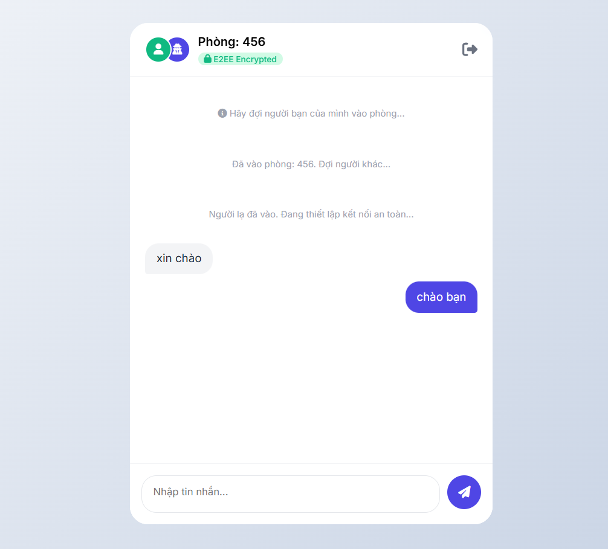
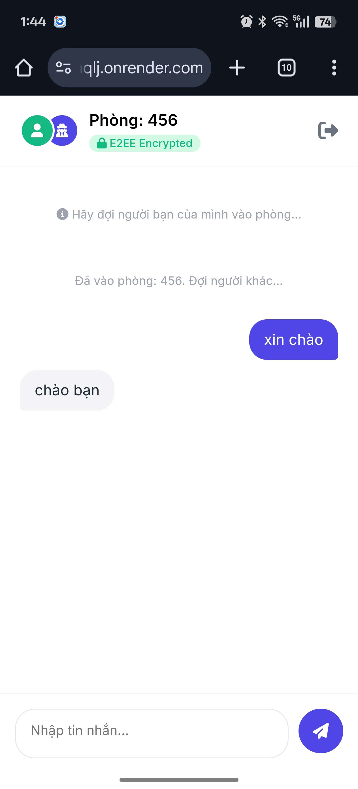

# 🔒 Secure P2P Chat (E2EE)


> **"Privacy is not an option, it is a right."**
> A serverless, end-to-end encrypted chat application that guarantees privacy by design. Messages travel directly between users via WebRTC, bypassing the server entirely.

 **Live Demo:** [https://p2p-chat-app-nqlj.onrender.com/](https://p2p-chat-app-nqlj.onrender.com/)

---

##  Screenshots

| Desktop View | Mobile View |
|:---:|:---:|
|  |  |
| *Clean interface with E2EE status* | *Fully responsive & Optimized for touch* |

*(Note: Please replace `demo-desktop.png` and `demo-mobile.png` with your actual screenshots)*

---

##  Key Features

* **End-to-End Encryption (E2EE):** Uses **Web Crypto API (RSA-OAEP 2048-bit)**. Keys are generated locally; the private key never leaves the browser.
* **Peer-to-Peer Architecture:** Messages are sent via **WebRTC Data Channels**, ensuring data never touches the database.
* **Reliable Connectivity (NAT Traversal):** Integrated custom **TURN Servers (via Metered.ca)** to bypass Symmetric NATs (works perfectly on 4G/5G and restrictive Public Wi-Fi).
* **Mobile-First Design:** Responsive UI/UX with touch optimization and `100dvh` support for mobile browsers.
* **Enhanced UX:** Support for `Enter` to send and `Shift+Enter` for new lines.
* **Zero-Knowledge Server:** The Node.js server acts only as a Signaling relay and stores **zero** message logs.

---

## Technical Stack

* **Frontend:** Vanilla JavaScript (ES6 Modules), HTML5, CSS3 (Flexbox/Grid).
* **Backend:** Node.js, Express.
* **Signaling:** Socket.io (Used only for handshake and exchanging ICE Candidates).
* **P2P Protocol:** WebRTC (RTCPeerConnection, RTCDataChannel).
* **Security:** Native Web Crypto API.
* **Infrastructure:** Render (Hosting), Metered.ca (TURN Server).

---

## How It Works (The Security Flow)

1.  **Key Generation:** Upon visiting the site, the browser generates a public/private RSA key pair.
2.  **Signaling (Handshake):**
    * User A & B join a room via Socket.io.
    * They exchange **Public Keys** and **ICE Candidates** (network paths) through the server.
3.  **P2P Tunneling:**
    * A direct WebRTC connection is established (using STUN/TURN servers if behind NAT).
    * The Socket.io connection becomes idle regarding message data.
4.  **Encrypted Transmission:**
    * User A types a message -> Encrypted with **B's Public Key**.
    * Ciphertext sent via WebRTC -> User B receives and decrypts with **B's Private Key**.

---

## Challenges & Solutions

During the development, I encountered a critical issue where devices on **4G/5G networks** could not connect with devices on Wi-Fi due to Symmetric NAT restrictions.

* **Problem:** The standard STUN server (`stun.l.google.com`) was insufficient for traversing strict cellular firewalls.
* **Solution:** Implemented a custom **TURN Server** credential rotation using Metered.ca. This acts as a fallback relay, ensuring 100% connectivity success rate across different network topologies.

---

## Run Locally

```bash
# 1. Clone the repository
git clone [https://github.com/dungameo0204/p2p-chat-app.git](https://github.com/dungameo0204/p2p-chat-app.git)

# 2. Navigate to project directory
cd p2p-chat-app

# 3. Install dependencies
npm install

# 4. Start the server
node server.js
Author
Hoàng Mạnh Dũng

Portfolio/Github: github.com/dungameo0204

Interest: Web Security, Real-time Communication, Blockchain.

This project is for educational purposes, demonstrating the implementation of E2EE without external libraries.